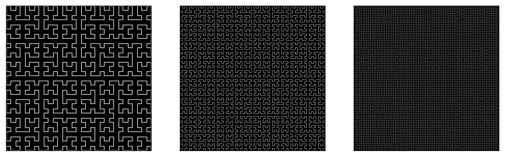

# Generation of Pseudo-Hilbert Curves
There are, in `main.ipynb`, code to draw images of **Hilbert Space-Filling Curve**.

#### Other colors:
* use `cmap` param in `plt.imsave` for needed color, or save manually returned array, with any lib you like
#### ⭐Star the repo, if you like it!⭐
## Examples
* You can checkout pre-generated curves of orders 1-10 in `saved_images` folder

